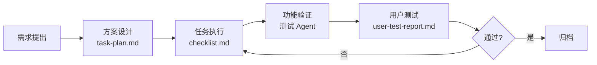

# 反馈机制设计

## 概述

反馈机制覆盖从需求提出到任务完成的完整闭环，确保每个阶段都有记录、审查和归档。

## 反馈流程

## 反馈文件规范

### 1. task-plan.md — 任务方案
- 在项目 `task-feedback/<project-name>/` 下
- 包含：项目概述、各模块状态表、已完成工作、待办事项
- 复杂变更前必须先写方案

### 2. checklist.md — 任务清单
- 使用 markdown 表格格式
- 每项包含：编号、任务描述、状态、完成日期、备注
- 底部汇总进度统计（总数 / 完成数 / 完成率）
- 状态值：✅ 已完成 / 🔄 进行中 / ⏳ 待开始 / ⚠️ 阻塞

### 3. user-test-report.md — 用户测试报告
- 测试完成后由测试 Agent 或人工编写
- 包含：测试日期、测试范围、功能列表（✅/❌/⚠️）
- 问题按优先级分级：🔴高 / 🟡中 / 🟢低
- 附测试结论和改进建议

### 4. decision-log.md — 架构决策日志
- 跨项目文件，位于 `task-feedback/` 根目录
- 每次重要架构/设计决策追加一条记录
- 格式：日期 → 决策内容 → 决策原因 → 影响范围

## 反馈标准

### 代码审查标准
- 类型检查零错误（`vue-tsc --noEmit`）
- 构建零错误通过
- 无未使用的 import 和变量
- 遵循项目现有代码风格

### 测试标准
- 单元测试覆盖核心引擎函数
- 组件测试覆盖关键交互逻辑
- 覆盖率目标：核心逻辑 ≥ 90%

### Bug 修复标准
- 先定位 root cause，再修复
- 最小化修改原则
- 修复后需验证有效性和无回归
