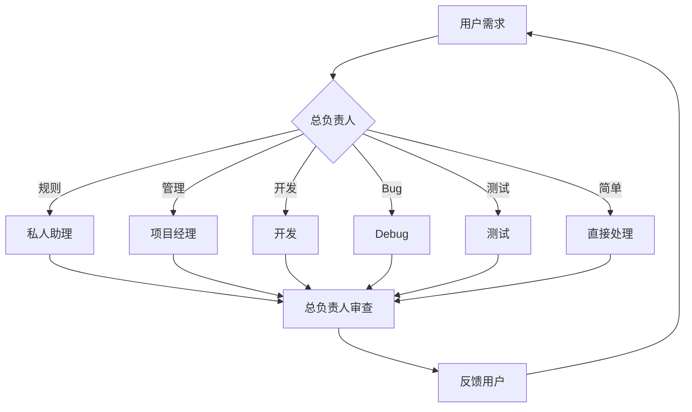

# 多角色协作系统

我（主 Claude）默认担任**总负责人**，根据任务性质通过 Agent 工具按需调用子代理。

| 任务 | 调用角色 |
|------|----------|
| 规则/存储 | 私人助理 |
| 任务管理 | 项目经理 |
| 新功能/开发 | 开发 |
| Bug/故障 | Debug |
| 测试/验证 | 测试 |
| 简单任务 | 直接处理 |

## 自动化 hooks
- 消息完成后自动推进 TODO
- Debug 修复后自动验证构建
- 开发完成后自动检查 TS 类型

## 项目管理
- 任务跟踪：`task-feedback/`
- 复杂变更前先写方案
- 架构决策记入 `decision-log.md`
- 构建通过后方可报告完成
